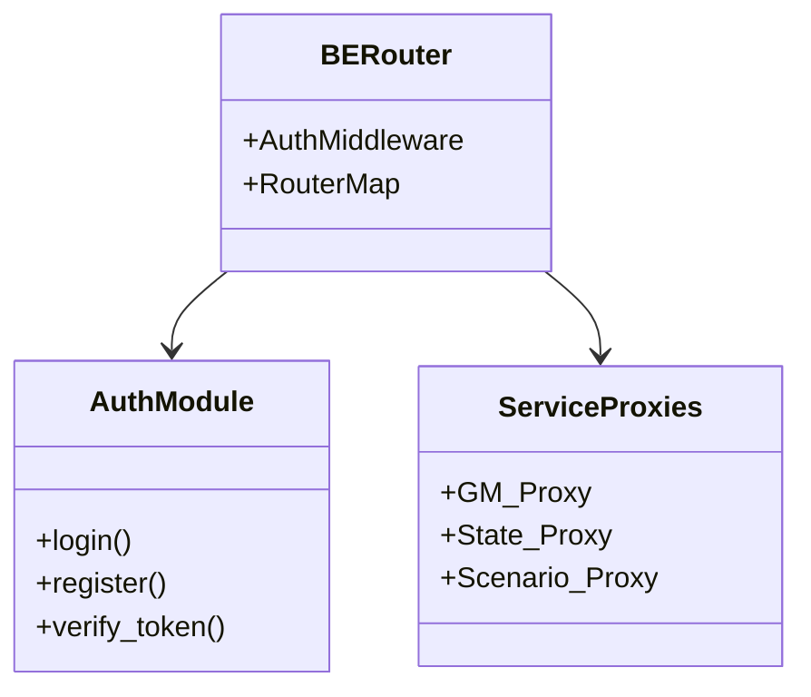
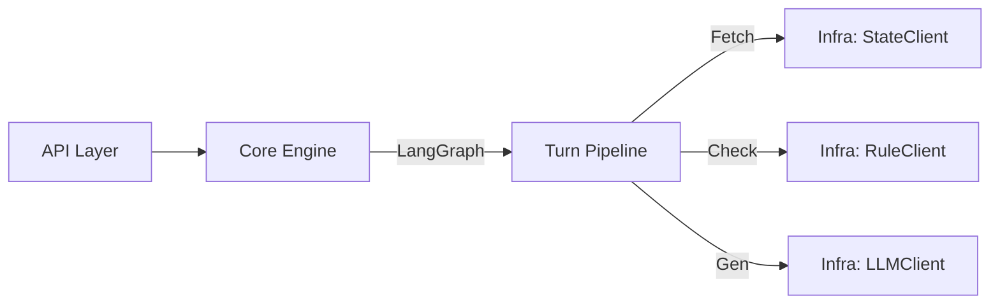
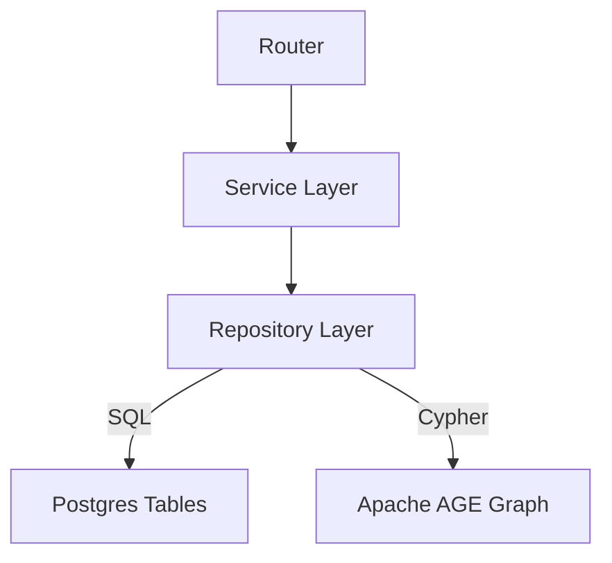
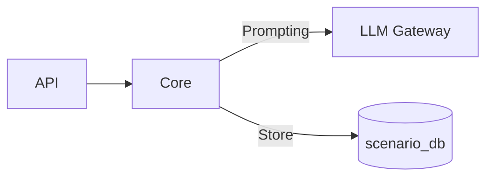
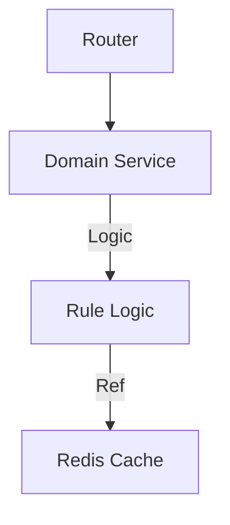
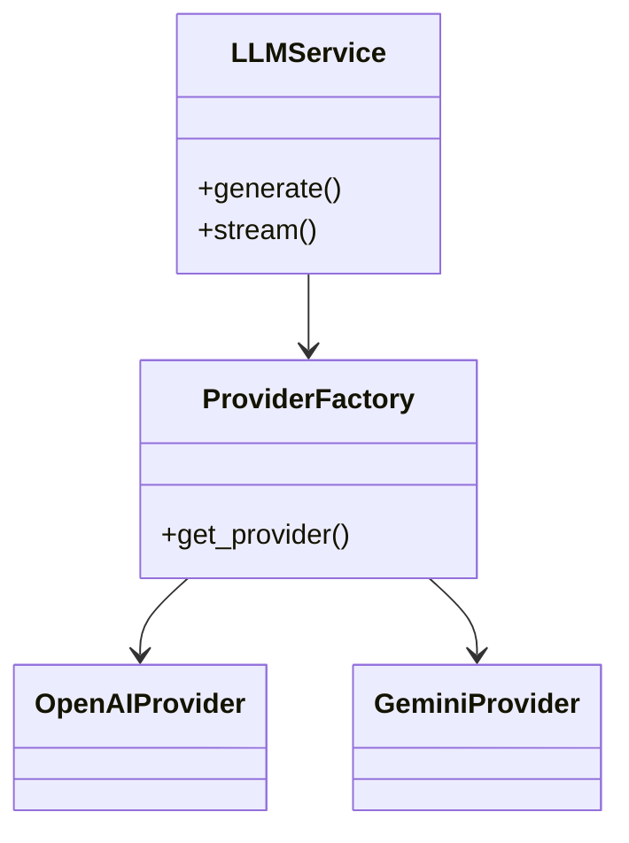

# GTRPGM 전체 아키텍처 (v0.1.0)

이 문서는 GTRPGM 플랫폼의 고수준 아키텍처, 서비스 간 상호작용 및 내부 컴포넌트 구조를 설명합니다.

## 시스템 컨텍스트 (서비스 맵)

플랫폼은 Docker Compose를 통해 오케스트레이션되는 6개의 마이크로서비스로 구성됩니다.

```mermaid
graph TD
    User[User / Web Client] -->|HTTP/REST| Router[BE-Router (8010)]
    
    subgraph Services
        Router -->|/gm| GM[GM Service (8020)]
        Router -->|/state| State[State Manager (8030)]
        Router -->|/scenario| Scenario[Scenario Service (8040)]
        Router -->|/rule| Rule[Rule Engine (8050)]
        Router -->|/llm| LLM[LLM Gateway (8060)]
        
        GM -->|orchestrates| State
        GM -->|validates| Rule
        GM -->|requests| Scenario
        GM -->|generates| LLM
        
        Rule -->|queries| State
        Scenario -->|injects| State
        Scenario -->|uses| LLM
        Rule -->|uses| LLM
    end
    
    subgraph Data
        Postgres[(Postgres 16)]
        Redis[(Redis)]
        
        GM -.->|gm_db| Postgres
        State -.->|state_db| Postgres
        Scenario -.->|scenario_db| Postgres
        Rule -.->|gtrpgm| Postgres
        Router -.->|gtrpgm| Postgres
        
        GM -.-> Redis
        Rule -.-> Redis
    end
```

## 서비스 상세

### 1. BE-Router (API 게이트웨이)
모든 외부 클라이언트 요청의 진입점입니다. 인증 및 라우팅을 담당합니다.

- **경로**: `BE-router/src`
- **주요 컴포넌트**:
  - `auth`: 사용자 인증 및 JWT 관리.
  - `gm`, `state`, `scenario`: 백엔드 서비스로 위임하는 라우트 핸들러.
  - `configs`: 환경 및 라우터 설정.



### 2. GM Service (게임 마스터)
게임 루프를 오케스트레이션하고, 턴 파이프라인을 관리하며, 서사를 생성합니다.

- **경로**: `gm/src/gm`
- **아키텍처**: 헥사고날 / 클린 아키텍처 지향
  - `api`: FastAPI 라우터 (`/turn`, `/session`)
  - `core`: 비즈니스 로직 (Turn Pipeline, LangGraph)
  - `infra`: 외부 어댑터 (StateClient, ScenarioClient)
  - `plugins`: 플러그인 가능한 로직



### 3. State Manager (상태 관리자)
관계형 데이터와 그래프 데이터(Apache AGE)를 모두 관리하는 게임 상태의 단일 진실 공급원(SSOT)입니다.

- **경로**: `state-manager/src/state_db`
- **컴포넌트**:
  - `routers`: 상태 CRUD를 위한 HTTP 엔드포인트.
  - `services`: 트랜잭션 관리 및 로직.
  - `repositories`: SQL/Cypher 실행.
  - `graph`: Apache AGE 그래프 연산.



### 4. Scenario Service (시나리오 서비스)
시나리오 생성(LLM 사용), 검증 및 관리를 담당합니다.

- **경로**: `scenario-service/src/scenario`
- **컴포넌트**:
  - `api`: 생성 및 관리 엔드포인트.
  - `core`: 생성기 로직 (Pure/Grounded/Informed 모드).
  - `infra`: DB 어댑터.



### 5. Rule Engine (룰 엔진)
게임 행동(예: 전투, 스킬 판정)에 대한 결정론적 규칙과 검증을 제공합니다.

- **경로**: `rule-engine/src/domains`
- **구조**: 도메인 주도 설계 (기능별)
  - `play`: 전투 및 행동 해결.
  - `user/session`: 검증 로직.



### 6. LLM Gateway (LLM 게이트웨이)
LLM 제공자(OpenAI, Gemini)에 대한 통합 인터페이스로, API 키 및 모델 라우팅을 처리합니다.

- **경로**: `llm-gateway/src/llm_gateway`
- **컴포넌트**:
  - `api`: `/chat/completions` 스타일 엔드포인트.
  - `core`: 제공자 라우팅 로직.
  - `extensions`: 제공자 구현체.



## 데이터베이스 토폴로지

단일 물리 Postgres 인스턴스 내에서의 논리적 분리 현황입니다.

| 서비스 | DB 이름 | 사용자 | 내용 |
|---|---|---|---|
| BE-Router | `gtrpgm` | `gtrpgm` | 사용자 인증, 전역 설정 |
| GM | `gm_db` | `gm_user` | 턴 로그, 세션 메타데이터 |
| State Manager | `state_db` | `state_user` | 월드 상태 (관계형 + 그래프) |
| Scenario | `scenario_db` | `scenario_user` | 시나리오 템플릿, 초안 |
| Rule Engine | `gtrpgm` | `gtrpgm` | (공유/레거시) 룰 설정 |

*참고: Redis는 캐싱 및 Pub/Sub 용도로 사용됩니다.*
