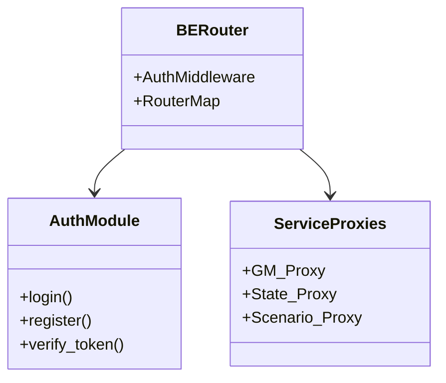
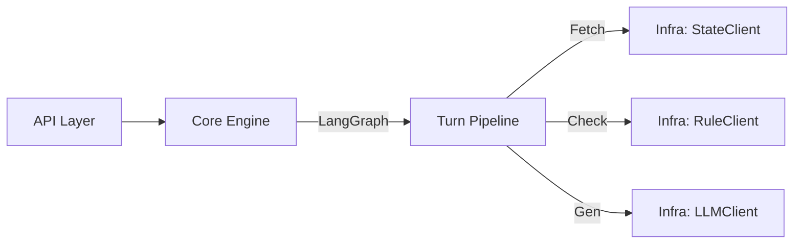
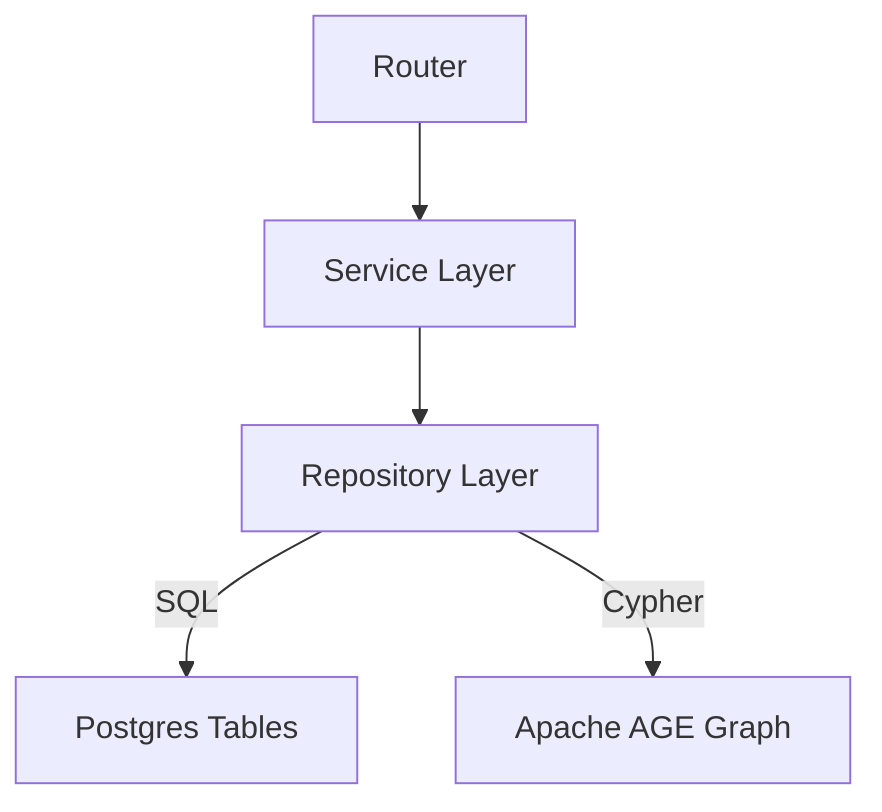
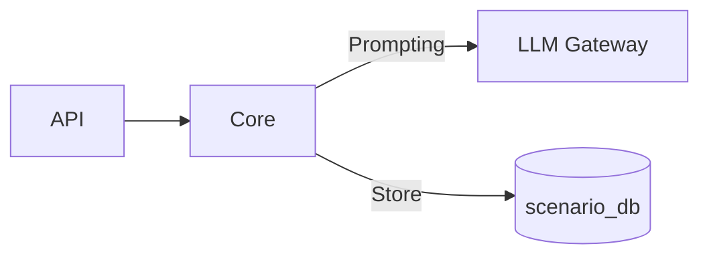
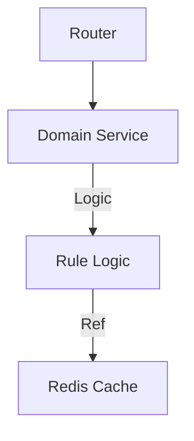
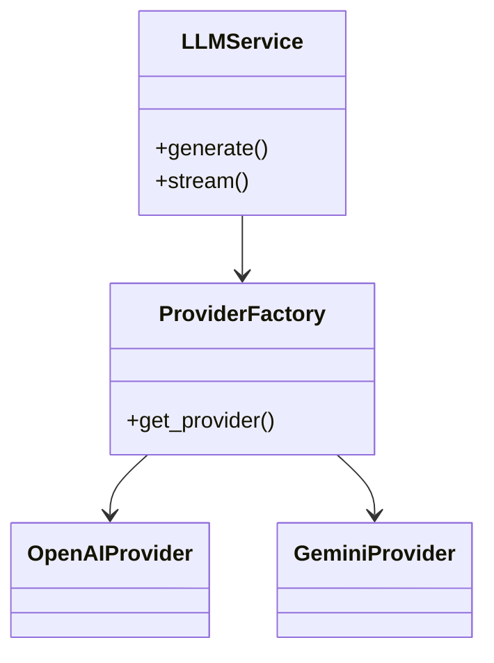

# Architecture v0.1.0

## Overview

This document describes the high-level architecture of the GTRPGM platform, including service interactions and internal component structures.

## System Context (Service Map)

The platform is composed of 6 microservices orchestrated via Docker Compose.

```mermaid
graph TD
    User[User / Web Client] -->|HTTP/REST| Router[BE-Router (8010)]
    
    subgraph Services
        Router -->|/gm| GM[GM Service (8020)]
        Router -->|/state| State[State Manager (8030)]
        Router -->|/scenario| Scenario[Scenario Service (8040)]
        Router -->|/rule| Rule[Rule Engine (8050)]
        Router -->|/llm| LLM[LLM Gateway (8060)]
        
        GM -->|orchestrates| State
        GM -->|validates| Rule
        GM -->|requests| Scenario
        GM -->|generates| LLM
        
        Rule -->|queries| State
        Scenario -->|injects| State
        Scenario -->|uses| LLM
        Rule -->|uses| LLM
    end
    
    subgraph Data
        Postgres[(Postgres 16)]
        Redis[(Redis)]
        
        GM -.->|gm_db| Postgres
        State -.->|state_db| Postgres
        Scenario -.->|scenario_db| Postgres
        Rule -.->|gtrpgm| Postgres
        Router -.->|gtrpgm| Postgres
        
        GM -.-> Redis
        Rule -.-> Redis
    end
```

## Service Details

### 1. BE-Router (API Gateway)
Entry point for all external client requests. Handles authentication and routing.

- **Path**: `BE-router/src`
- **Key Components**:
  - `auth`: User authentication & JWT management.
  - `gm`, `state`, `scenario`: Route handlers delegating to backend services.
  - `configs`: Environment & Router configuration.



### 2. GM Service (Game Master)
Orchestrates the game loop, manages turn pipelines, and handles narrative generation.

- **Path**: `gm/src/gm`
- **Architecture**: Hexagonal / Clean Architecture-ish
  - `api`: FastAPI routers (`/turn`, `/session`)
  - `core`: Business logic (Turn Pipeline, LangGraph)
  - `infra`: External adapters (StateClient, ScenarioClient)
  - `plugins`: Pluggable logic



### 3. State Manager
The Single Source of Truth (SSOT) for game state, managing both relational data and graph data (Apache AGE).

- **Path**: `state-manager/src/state_db`
- **Components**:
  - `routers`: HTTP endpoints for state CRUD.
  - `services`: Transaction management, logic.
  - `repositories`: SQL/Cypher execution.
  - `graph`: Apache AGE graph operations.



### 4. Scenario Service
Handles scenario generation (using LLM), validation, and management.

- **Path**: `scenario-service/src/scenario`
- **Components**:
  - `api`: Generation & Management endpoints.
  - `core`: Generator logic (Pure/Grounded/Informed modes).
  - `infra`: DB adapters.



### 5. Rule Engine
Provides deterministic rules and validations for game actions (e.g., combat, skill checks).

- **Path**: `rule-engine/src/domains`
- **Structure**: Domain-Driven Design (by feature)
  - `play`: Combat & Action resolution.
  - `user/session`: Validation logic.



### 6. LLM Gateway
Unified interface for LLM providers (OpenAI, Gemini), handling API keys and model routing.

- **Path**: `llm-gateway/src/llm_gateway`
- **Components**:
  - `api`: `/chat/completions` style endpoints.
  - `core`: Provider routing logic.
  - `extensions`: Provider implementations.



## Database Topology

Logical separation within a single physical Postgres instance.

| Service | DB Name | User | Content |
|---|---|---|---|
| BE-Router | `gtrpgm` | `gtrpgm` | User Auth, Global Config |
| GM | `gm_db` | `gm_user` | Turn Logs, Session Metadata |
| State Manager | `state_db` | `state_user` | World State (Relational + Graph) |
| Scenario | `scenario_db` | `scenario_user` | Scenario Templates, Drafts |
| Rule Engine | `gtrpgm` | `gtrpgm` | (Shared/Legacy) Rule Configs |

*Note: Redis is used for caching and pub/sub where applicable.*
